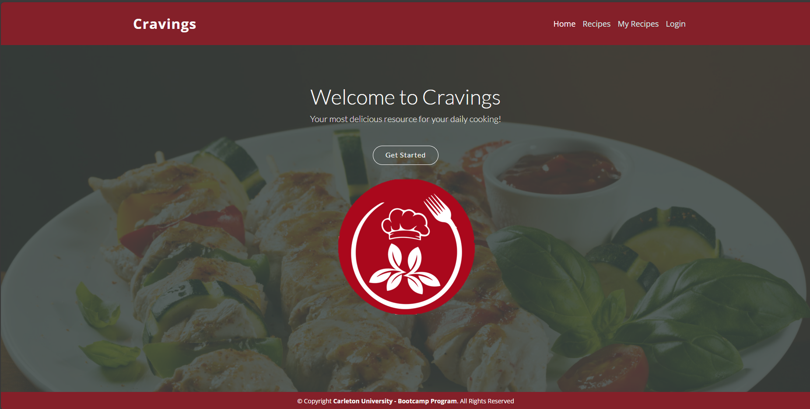
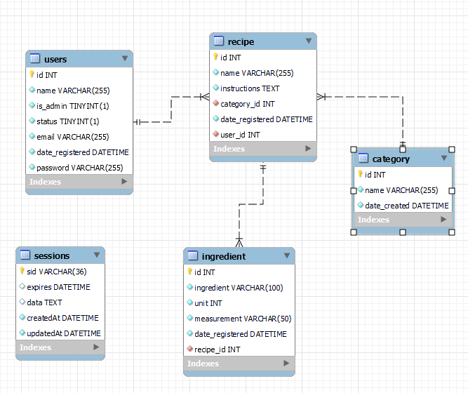

<a id="readme-top" name="readme-top"></a>

<p align="center"></p>

<p align="center" style="margin-top:25px; margin-bottom:50px;">
	<a></a>
	<a></a>
	<a></a>
	<a></a>
	<a></a>
</p>

# Carlton Coding Bootcamp Certification

<details style="margin-bottom: 25px; margin-top: 25px;">
	<summary>Table of Contents</summary>
	<ol>
		<li><a href="#Description">Cravings Site</a></li>
		<li><a href="#installation">Installation</a></li>
          <li><a href="#technology">Technology Stack</a></li>
          <li><a href="#database">Cravings Database</a></li>
		<li><a href="#usage">Application Usage</a></li>
		<li><a href="#license">License</a></li>
	</ol>
</details>

<div id="Description" style="margin-top: 25px;">

## Cravings Site

The craving site was developed during our second group project at Carleton University Coding Bootcamp. It required for us to use all we have learned up to now.

The website is based on MVC paradigm running under node Express.js server, with handlabars front-end and a database hosted in Heroku site. The actual website is running under Heroku platform. [Heroku](https://www.heroku.com/what) is the quickest way for a company to become an apps company. Heroku is a service that enables companies to spend their time developing and deploying apps that immediately start producing value.

The data is stored in MySQL Server. [MySQL](https://www.hostinger.com/tutorials/what-is-mysql) is an open-source Relational Database Management System (RDBMS) that enables users to store, manage, and retrieve structured data efficiently. It is widely used for various applications, from small-scale projects to large-scale websites and enterprise-level solutions.

Here is our product!

<div style="margin-top: 15px;">
	
</div>
</div>

<p align="right">(<a href="#readme-top">back to top</a>)</p>

<div id="installation" style="margin-bottom: 20px;margin-top: 20px;">

## Installation

1. Install Node 18 or later. 
2. Clone this repository : `git@github.com:SonjaGorin/Cravings.git`
3. Run `npm i` to install the dependencies.
4. Run `npm start` to start the API server.
5. When you run the application for the first time, database will be creaed.

**Important Note**: you must have MySQL installed and configured in your computer, you will need a root user and a regular user. We also recommend you install MySQL Workbench. MySQL is developed by Oracle you can download a free version from their [website](https://dev.mysql.com/doc/mysql-installation-excerpt/5.7/en/). To install MySQL follow this [installation guide](https://coding-boot-camp.github.io/full-stack/mysql/mysql-installation-guide). You will also need to install [npm dotenv](https://www.npmjs.com/package/dotenv), Dotenv is a zero-dependency module that loads environment variables from a .env file into process.env.

Once you have completed the configuration of MySQL then you can run manually the db/schema.sql -which contains NO data, this is to create the eCommerce_db. To run the process using MySQL CLI trigger the following command to initialize the databse. Ultimately you can also create the database using MySQL Workbench

```
	mysql -u root -p
	source db/schema.sql
```

The seeding of the tables will be performed by the application through Sequelize npm package.

Dependancies included in the package.json:

```
     bcrypt - version 5.0.0
     chalk - version 4.1.2
     connect-session-sequelize - version 7.0.4
     dotenv - version 8.2.0
     express - version 4.17.1
     express-handlebars - version 5.2.0
     express-session - version 1.17.1
     figlet - version 1.7.0
     mysql2 - version 2.2.5
     node-notifier - version 10.0.1
     sequelize - version 6.3.5
```
</div>

<p align="right">(<a href="#readme-top">back to top</a>)</p>

<div id="technology" style="margin-top: 25px;">

## Technology Stack

The following should list any major frameworks/libraries used to in the designing and coding of **eCommerce Express Application**.
This section  bootstrap your project. Leave any add-ons/plugins for the acknowledgements section. Here are a few examples.

* <a href="https://www.npmjs.com/package/chalk"></a> Make message colorful and pleasing to the eye
* <a href="https://www.mysql.com/products/workbench/"></a> MySQL Server and Workbench application
* <a href="https://www.npmjs.com/package/dotenv"></a> Dotenv environment variables
* <a href="https://www.npmjs.com/package/express"></a> The Express philosophy is to provide small, robust tooling for HTTP servers, making it a great solution for single page applications, websites, hybrids, or public HTTP APIs.
* <a href="https://www.tsql.info/"></a> Transac-SQL language to retrieve data from database - JOIN queries, Nested and aggregate queries 
* <a href="https://developer.mozilla.org/en-US/docs/Web/javascript"></a> Use Javascript as the main language - used classes and module exports.
* <a href="https://developer.mozilla.org/en-US/docs/Web/mysql2"></a> MySQL2 project is a continuation of MySQL-Native. Protocol parser code was rewritten from scratch and api changed to match popular mysqljs/mysql.
* <a href="https://www.npmjs.com/package/sequelize"></a> Sequelize is an easy-to-use and promise-based Node.js ORM tool for Postgres, MySQL, MariaDB, SQLite, DB2, Microsoft SQL Server, and Snowflake. It features solid transaction support, relations, eager and lazy loading, read replication and more.. 
* <a href="https://www.npmjs.com/package/sequelize"></a> Hand-crafted lightweight and easy to use Rest Client for Testing APIs. Supports collections, environments and local storage.

</div>

<p align="right">(<a href="#readme-top">back to top</a>)</p>

<div id="database" style="margin-top: 25px;">

## Cravings Database

The Cravings database - hosted on <span style="color:cyan">Oracle MySQL</span> running under Heroky environment, is relatively simple, it contains 4 tables implemented with simple relationships yet string enough to ensure data integrity. Also known as referential integrity. Tables and fields have been created using **Sequelize ORM** standard naming conventions. Primary keys are using in this case autoincremental numeric fields.

The following image shows the database model for the eCommerce Database:

<div style="margin-right:30px;margin-top: 15px;">
	<p align="center"></p>
</div>

</div>

<p align="right">(<a href="#readme-top">back to top</a>)</p>


<div id="usage" style="margin-top: 25px;">

## Application Usage

The application is pretty simple to use. Once you launch the website you will have to register and create an account. Once you have an account, you'll be able to browse and post your recipes in the website. As a member you'll have access to all members recipes.

The recipes can be filtered by category or by members, making it simple to find the recipes you are looking for. Members will be able to modify their own recipes, but not those who belong to a different member.


<p align="right">(<a href="#readme-top">back to top</a>)</p>

</div>

<div id="license" style="margin-top: 25px;">

## License

MIT License

Copyright (c) 2023 Cravings Site

Permission is hereby granted, free of charge, to any person obtaining a copy of this software and associated documentation files (the "Software"), to deal in the Software without restriction, including without limitation the rights to use, copy, modify, merge, publish, distribute, sublicense, and/or sell copies of the Software, and to permit persons to whom the Software is furnished to do so, subject to the following conditions:

The above copyright notice and this permission notice shall be included in all copies or substantial portions of the Software.

THE SOFTWARE IS PROVIDED "AS IS", WITHOUT WARRANTY OF ANY KIND, EXPRESS OR IMPLIED, INCLUDING BUT NOT LIMITED TO THE WARRANTIES OF MERCHANTABILITY, FITNESS FOR A PARTICULAR PURPOSE AND NONINFRINGEMENT. IN NO EVENT SHALL THE AUTHORS OR COPYRIGHT HOLDERS BE LIABLE FOR ANY CLAIM, DAMAGES OR OTHER LIABILITY, WHETHER IN AN ACTION OF CONTRACT, TORT OR OTHERWISE, ARISING FROM, OUT OF OR IN CONNECTION WITH THE SOFTWARE OR THE USE OR OTHER DEALINGS IN THE SOFTWARE.

<a></a>

<p align="right">(<a href="#readme-top">back to top</a>)</p>

</div>


---
© 2023 edX Boot Camps LLC. Confidential and Proprietary. All Rights Reserved. Developed by Gustavo Miller